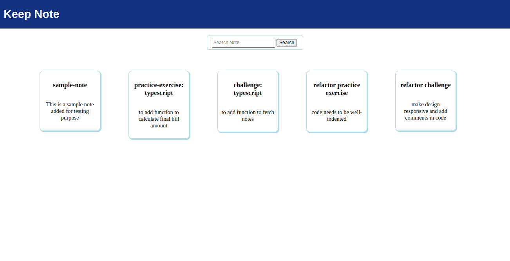
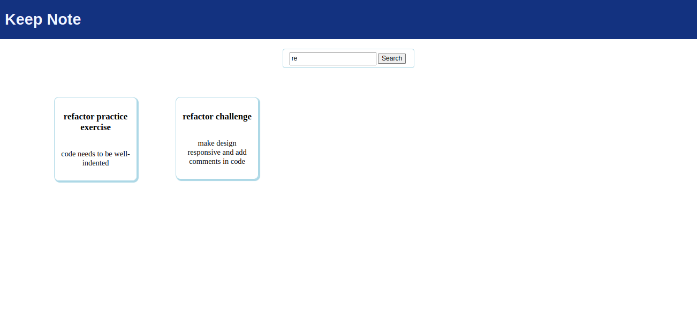

# Challenge - Create Components for Keep Note Application

## Context

Keep Note is a web application that lets users maintain notes. It should be designed as a single-page application.
​

In the first development phase, the application should read notes from an array which is declared in a separate file. For convenience, the application should provide search functionality to allow users to search for notes by the title of the note. ​​

## Problem Statement

Design a single-page application for Keep Note with Header and Dashboard components using Angular CLI.

Below is the expected single page output.
 

### Task Details

Following are the tasks to complete this challenge.​

#### Task 1: Create Components​
   - Create an Angular application `kKeep-note` using Angular CLI command.​
                   ng new keep-note​
   - Create `Header` and `Dashboard` components inside the `app` folder.​
   - Render the components using a component selector as per the hierarchy. ​

        - `App` component should render `Header` and `Dashboard` components.​
        - `Header` component should render the application with title as `Keep Note`.​
        - `Dashboard` component should display a search textbox followed by a list of notes in grid format.

#### Task 2: Create Data Models​
   - Create data models under the folder with the name `models`.​
   - Create type `Note` in the `note.ts` file in the `models` folder with the following type properties:​
        - id (number)​
        - title (string)​
        - content (string)
   - Create constant `NOTES` in `notes.ts` file in `models` folder.​
      - The `NOTES` constant should store an array with the following notes data: 
  
 | id  | title                         | content                                         |
 | --- | ----------------------------- | ----------------------------------------------- |
 | 1   | sample-note                   | This is a sample note added for testing purpose |
 | 2   | practice-exercise: typescript | to add function to calculate final bill amount  |
 | 3   | challenge: typescript         | to add function to fetch notes                  |
 | 4   | refactor practice exercise    | code needs to be well-indented                  |
 | 5   | refactor challenge            | make design responsive and add comments in code |  ​

#### Task 3: Design Header​ Component
  - Modify the `Header` component to display the application title as `Keep Note.` ​
  - The below image shows a sample layout of the header. ​
  - Background color can be different but should be aesthetically pleasing. ​

  

#### Task 4: Display Notes​
  - `Dashboard` component should read notes from the `NOTES` array defined in the `Notes.ts` file.​
  - The `Dashboard` component should traverse the `notes` array using  the`*ngFor` directive and render the properties (title and content) of the `note` object to display note data.​

#### Task 5: Search Notes
  - Design the UI for search functionality by adding a text box and a search button.​
  - Add the `Search` button, which calls the component's searchNote() method whenever the button is clicked using the event binding technique.​
  - Write the search logic inside the searchNote() method to filter the notes that contains the note title using the Array filter method.​
     - Matching notes with the note title that contains the search text should be displayed.
     - All notes should be displayed when the search text is empty.​
- Below is the expected output of the Keep Note aplication with search functionality.

