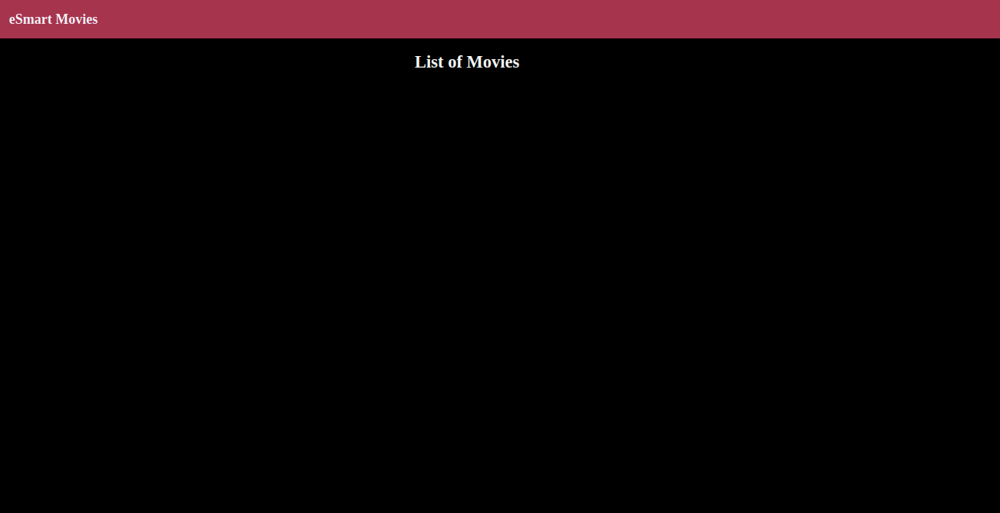
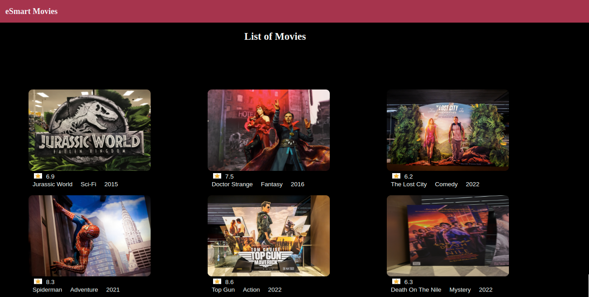
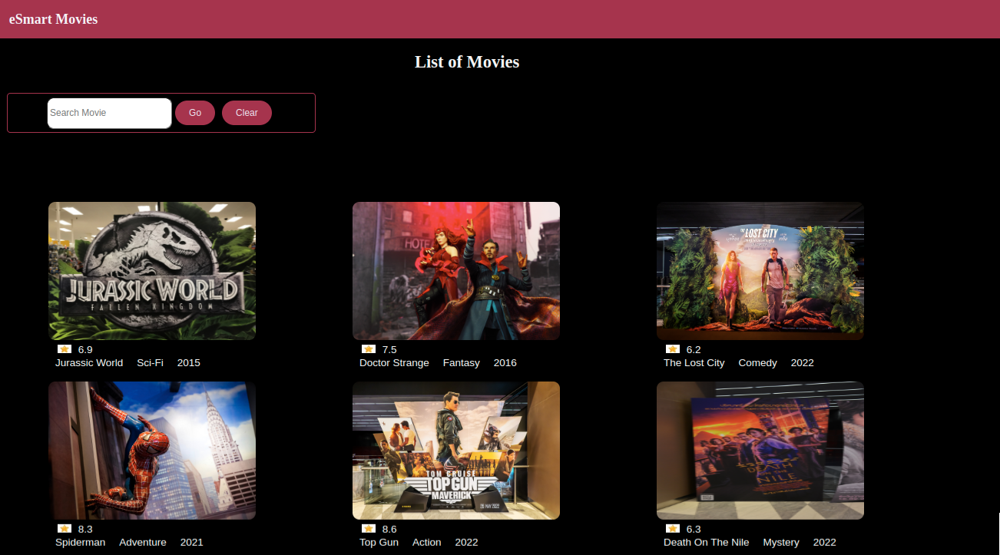
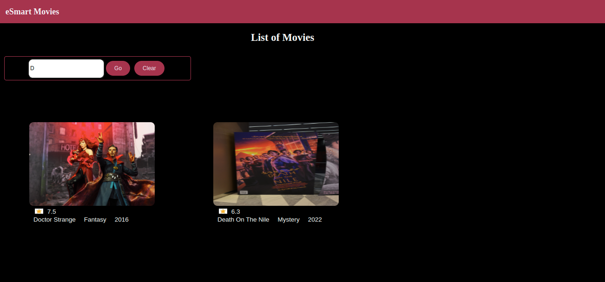

## Practice

This practice comprises 3 exercises.

## Implementation ENvironment

Install the following before starting the practices.​

- Install Angular CLI using the command in the terminal:​

        npm install -g @angular/cli​
- Check the successful installation by giving the following command:​

       ng --version

## Context

eSmart Movies is a popular and trusted source of movies and TV shows. One could find ratings and reviews for the newest movies and TV shows on eSmart Movies.​

Create a single-page application using Angular CLI that displays a list of movies to the end users. Movie information like movie name, poster, genre, and ratings should be visible to the user. ​

Additionally, the users should also be able to search for a movie from the list of movies displayed. 

### Problem Statements

#### Practice 1 - Create Components for Angular eSmart-Movies Application

Using Angular CLI commands, create an Angular application and add header and dashboard components to it. Following are the steps to complete this practice.

- Step 1: Open the terminal and navigate to the folder p1-create-components. Create an Angular application named `esmart-movies` using the following Angular CLI command:​
                 
        ng new esmart-movies​
- Step 2: Create the identified components for the eSmart Movies application.​
- To create a component, use the Angular CLI command.​
     `ng generate component <component-name>` or `ng g c <component-name>`
     ​
- Render the component as mentioned below:​
- Step 3: `App` component should render `Header` and `Dashboard` components​.
    ```html
    <app-header></app-header>​
    <app-dashboard></app-dashboard>
    ```
- Step 4: `Header` component should render the site name `eSmart Movies`
    - Declare a string within the class definition to store the title inside `header.component.ts`.​
    ```ts
        headerTitle:string = "eSmart Movies";
    ```
    - Display the title using text interpolation by adding the code inside `header.component.html`.​
    ```html
        <h1>{{headerTitle}}</h1>
    ```
- Step 5: `Dashboard` component should display the title "List of Movies" using text interpolation​.
- Step 6: Design and style the components to generate the expected output.​
- Step 7: Run the application by giving the command in the terminal: `ng serve -o​`

- Below is the snapshot of the output expected:



#### Practice 2 - Display a List of Movies

Modify the eSmart Movies application to display the list of movies in a grid format in the dashboard component. Following are the steps to complete this practice.

- Step 1: On the command terminal, change the path to folder `p2-display-movies\esmart-movies` and copy the solution of the esmart-movies application developed in the previous exercise.​
- Step 2: Copy the images available in the `resources` folder of the boilerplate to `src/assets` folder of the esmart-movies application.​
- Step 3: Create a folder with the name `models` under the `app` folder of the `esmart-movies` application.
- Step 4: Copy the `movies.ts` and `movie.ts` files from the `resources` folder provided with the boilerplate code to the `models` folder.
    - The `MOVIES` array, defined in the `movies.ts` file stores the object of type `Movie`. The type `Movie` is defined in the `movie.ts` file. ​

      Notes:
    - Movie is a TypeScript object.​
    - MOVIES is a constant which contains an array of Movie object.
- Step 5: The dashboard view should be rendered by the `Dashboard` component that reads the data from the `MOVIES` array and assigns them to the `movies` property of the component class.
    - Inside `dashboard.component.ts`, add the following code within the class definition.​
    ```ts
       movies = MOVIES;
- Step 6: On the `Dashboard` template, iterate through the `movies` property using the `*ngFor` directive. ​
    - For each iteration, the `movie` object traversed, the `Dashboard` component should render the `movie` object properties like a movie poster, rating, title, genre, and year of release using Angular text interpolation. ​
    - Inside `dashboard.component.html`, add the following code:​
        ```html
        <div class="card" *ngFor="let movie of movies">
           
           <div class="card-content">
              <span>{{movie.rating}}</span><br> 
              <span>{{movie.movieTitle | titlecase }}</span>
              <!-- Write for other movie properties -->
            </div>
        </div>
        ```
- Step 7: Style the components by adding the appropriate code inside `dashboard.component.css` to generate the expected output.​
- Step 8: Run the application by giving the command in the terminal: `ng serve -o​`

- Below is the snapshot of the output expected:



#### Practice 3 - Search Movies

Modify the eSmart Movies application to allow users to search for movies. Following are the steps to complete this practice.

- Step 1: On the command terminal, change the path to folder `p3-search-movies\esmart-movies` and copy the solution of the esmart-movies application developed in the previous exercise.
- Step 2: Inside `dashboard.component.html`, add the `Go` button, which calls the component's search() method whenever the button is clicked using the event binding technique.​
       `<button (click) = "search()" type = button>Go</button>`​
- Step 3: Similarly, add the `Reset` button to call the component's reset()  method to clear any typed text.​
       `<button (click) = "reset()" type = button>Reset</button>`​
- Step 4: Inside `dashboard.component.ts`, declare `searchText` as a component property and bind it with the template using ngModel to capture the value when the user types in the search text box.
    ```ts
      searchText: string = '';
- Step 5: Inside `dashboard.component.ts`, write the search logic inside the `search()` method to filter the data using the Array filter method.​ All movies should be displayed when the search text is empty.​
    ```ts
        search() {
            if (this.searchText === '' || !this.searchText)
              this.movies = MOVIES;
            else {
              this.movies = MOVIES;
              this.movies = this.movies.filter(movie => movie.movieTitle?.startsWith(this.searchText.toLowerCase()));
        }
    ```
- Step 6: Inside `dashboard.component.ts`, set the `searchText` value equal to an empty string and movies property value to the `MOVIES` array within `reset()` method. ​
- Step 7: Style the components inside `dashboard.component.css` to generate the expected output.​
- Step 8: Run the application by giving the command: `ng serve -o`

- Below is the snapshot of the expected output with no search criteria.



- Below is the snapshot when movies are searched with text "D".



- Below is the snapshot when movies are searched with text "Juraasic".


