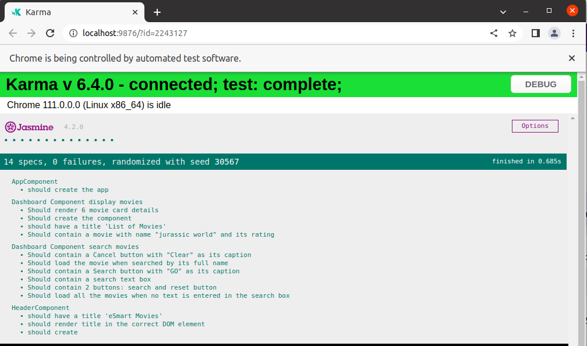

## Enable Testing for an Angular Application

## Context

eSmart Movies is a popular and trusted source of movies and television shows. One can find ratings and reviews for the latest movies and television shows on eSmart Movies. ​
​

The eSmart Movies SPA created using Angular CLI displays a list of movies to the end users. The users can see the name of the movie, poster, genre, and ratings.  Additionally, the users can search for a movie from the list of movies displayed.​
​

The components created in the eSmart Movies application should be tested to ensure a quality product. ​

### Problem Statement

Create test cases to enable testing for the solution of eSmart Movies application.
- The test code should ensure: ​
    - The expected title is available in the Header component. ​
    - The Dashboard component displays the list of movies as expected.​
    - The Dashboard Component enables the search for movies as expected.​

#### Tasks

 Following are the tasks to complete this exercise:​
- Task 1: Test App Component​
- Task 2: Test Header Component​
- Task 3: Test Dashboard Component

Copy the solution of eSmart Movies application created inside `p3-search-movies` of `fe-c4-s2-components-practice` of sprint 2 – `Develop SPA Using Angular Components` into the root folder.​

#### Task 1: Test App Component
Open the `app.component.spec.ts` and reuse the generated test code to test whether the component is instantiated successfully​.

```ts
    it('should create the app', () => {
        const fixture = TestBed.createComponent(AppComponent);
        const app = fixture.componentInstance;
        expect(app).toBeTruthy();
    });
```

#### Task 2: Test Header Component
- Open the `header.component.spec.ts` and refactor the genearted test code to test whether 
    - the component is instantiated successfully​,
    - title `eSmart Movies` is displayed as expected.​

    ```ts
        it('should render title in the correct DOM element', () => {
        const compiled = fixture.nativeElement as HTMLElement;
        expect(compiled.querySelector('h1')?.textContent).toContain('eSmart Movies');
        });
    ```
- Refactor `header.component.ts` code to achieve the expected result if the test cases are failing.

#### Task 3: Test Dashboard Component
- Open the `dashboard.component.spec.ts` and refactor the generated test code to test various functionality as given below.

|Functionality|Test Conditions|
|---|---|
|Display Movies|Should display 6 movie card details​|
|Display Movies|Should contain a movie with name "jurassic world" and its rating|
|Search Movies|Should contain a search text box
|Search Movies|Should contain 2 buttons: search and reset button
|Search Movies|Should contain a Search button with "GO" as its caption
|Search Movies|Should contain a Cancel button with "Clear" as its caption
|Search Movies|Should load the movie when searched by its full name
|Search Movies||Should load all the movies when no text is entered in the search box​

- Refactor `dashboard.component.ts` code to achieve the expected result if the test cases are failing.

**Display Movies Test Specs**

- Create a test suite for testing display movies functionality using a describe() function.​
- Test case: Should display 6 movie card details.​

    ```ts
        it('Should render 6 movie card details', () => {
        const compiled = fixture.nativeElement as HTMLElement;
        expect(compiled.querySelectorAll('.card')?.length).toBe(6);
       });
    ```

- Test case: Should contain a movie with name "jurassic world" and its rating​

    ```ts
        it('Should contain a movie with name "jurassic world" and its rating', () => {
        const compiled = fixture.nativeElement as HTMLElement;
        expect(compiled.querySelector('.title')?.textContent?.toLowerCase()).toContain('jurassic world');
        // Add code to verify the rating value
        });
    ```

**Search Movies Test Specs**
- Create a test suite for testing search movies functionality using a describe() function.​
- Test Case: Should contain 2 buttons: search and reset button.​

    ```ts
        it('Should contain 2 buttons: search and reset button', () => {
            const compiled = fixture.nativeElement as HTMLElement;
            expect(compiled.querySelectorAll('button[type=button]').length).toBe(2);
        });
    ```
- Test Case: Should contain a search button with "Go" as its caption.​

    ```ts
        it('Should contain a Search button with "GO" as its caption', () => {
            const compiled = fixture.nativeElement as HTMLElement;
            expect(compiled.getElementsByTagName('button')[0].textContent).toEqual('Go');
        });
    ```

- Test Case: Should load the movie when searched by its full name.​

    ```ts
        it('Should load the movie when searched by its full name', async(() => {
            const compiled = fixture.nativeElement as HTMLElement;
            fixture.detectChanges();
            fixture.whenStable().then(() => {
            let input = fixture.debugElement.query(By.css('input'));
            let el = input.nativeElement;
            el.value = "spiderman";
            el.dispatchEvent(new Event('input'));
            expect(component.searchText).toBe('spiderman');
            let button = fixture.debugElement.query(By.css('button'));
            button.triggerEventHandler('click', null);
            fixture.detectChanges();
            expect(compiled.querySelectorAll('.card')?.length).toBe(1);
            //write code to verify the title is spiderman and rating is 8.6
            })
        }));  
    ```

- Test Case: Should load all the movies when no text is entered in the search box.

    ```ts
        it('Should load all the movies when no text is entered in the search box', async(() => {
            const compiled = fixture.nativeElement as HTMLElement;
            fixture.detectChanges();
            fixture.whenStable().then(() => {
            let button = fixture.debugElement.query(By.css('button'));
            button.triggerEventHandler('click', null);
            fixture.detectChanges();
            expect(compiled.querySelectorAll('.card')?.length).toBe(6);
            })
        }));
    ```

**Expected output: Screenshot of the report generated by Karma Test Runner**

