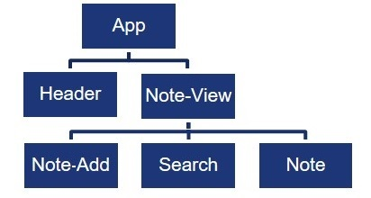
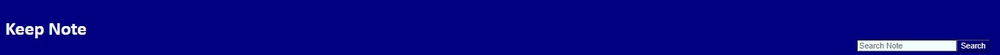
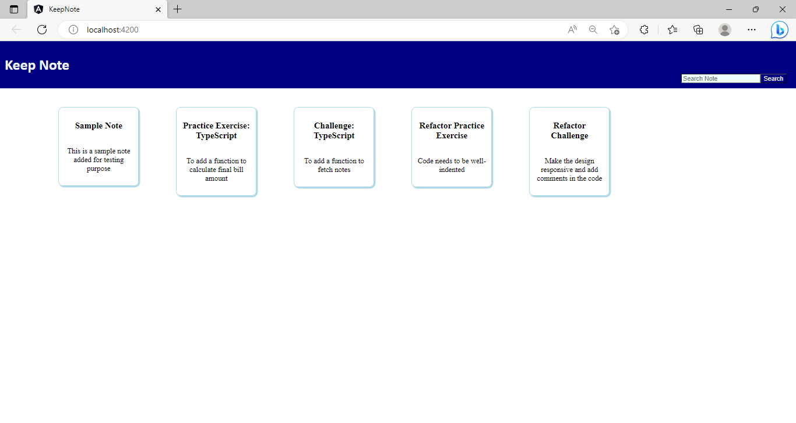
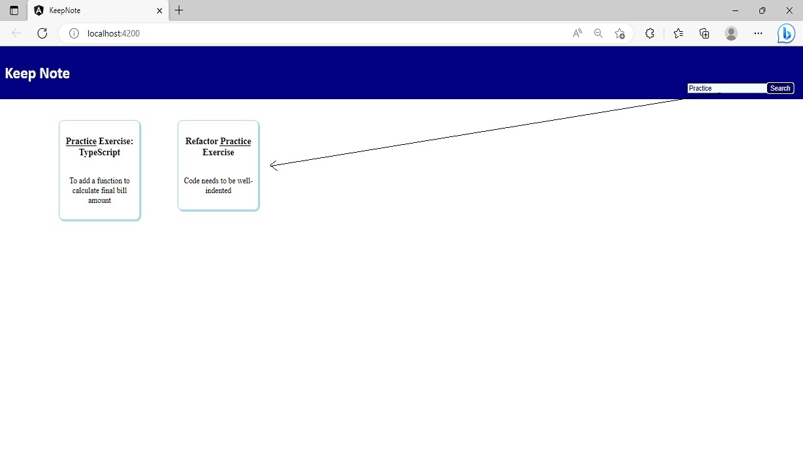
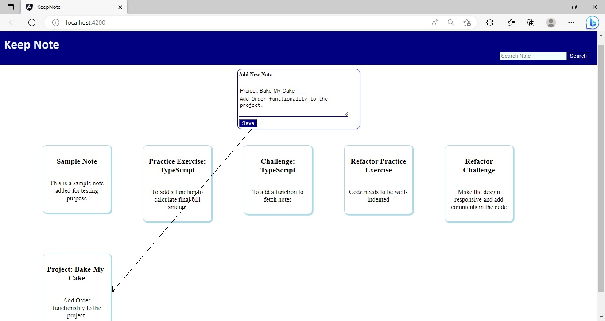

## Challenge - Create `Keep-Note` Application with Multiple Interacting Components

### Points to Remember
- Components should be created as per the given component hierarchy. 
- Angular CLI command should be used to create the components. 
- CSS classes defined in the.css files of the respective components should be used to style the components  
- The color, background color, font, and other CSS properties can be added to create pleasing aesthetics. 
- The names of components, properties, methods given in the task instructions are used in testing, so you must use the same names while coding.

### Instructions for Challenge

- Fork the boilerplate into your own workspace. ​
- Clone the boilerplate into your local system. ​
- Open command terminal and set the path to the folder containing the cloned boilerplate code.​
- Run the command `npm install` to install the dependencies.
- Open the folder containing the boilerplate code in VS Code.​
- Complete the solution in the given partial code provided in the boilerplate.

Notes:
1. The solution of this challenge will undergo an automated evaluation on the `CodeReview` platform. (Local testing is recommended prior to the testing on the `CodeReview` platform)
2. The test cases are available in the boilerplate.

### Context

As you are aware, `Keep-Note` is a web application that allows users to maintain notes. It is developed as a single-page application using multiple components. 

Note: The stages through which the development process will be carried out are shown below:
- Stage 1: Create basic `Keep-Note` application to add and view notes.
- Stage 2: Implement unit testing for the `Keep-Note` application.
- **Stage 3: Create `Keep-Note` application with multiple interacting components to add, view and search notes.**
- Stage 4: Implement persistence in the `Keep-Note` application.
- Stage 5: Style the `Keep-Note` application using Material design.
- Stage 6: Create simple form with validation in the `Keep-Note` application.
- Stage 7: Create complex form with validation in the `Keep-Note` application.
- Stage 8: Enable navigation in the `Keep-Note` application.
- Stage 9: Secure routes in the `Keep-Note` application

In this sprint, we are at Stage 3.

In this development stage, the application should add and read notes from an array that is declared in a separate file. For convenience, the application should allow users to search for notes by the title of the note.

#### Problem Statement

Develop the `Keep-Note` application as an SPA with multiple components. The application should display notes, allow searching for a note by its title and allow adding a new note.

​Note: The tasks to develop the solution are given below:

#### Task 1: Create Data Models
- Create data models under the folder with the name models.
- Create a type Note in the note.ts file in the models folder with the following type properties:
    - `id` (number)
    - `title` (string)
    - `content` (string)
- Create constant `Notes` in the `notes.ts` file in the `models` folder.
    - The `Notes` constant should be an array with the following notes data:

    | id  | title                         | content                                         |
    | --- | ----------------------------- | ----------------------------------------------- |
    | 1   | Sample Note                   | This is a sample note added for testing purpose |
    | 2   | Practice Exercise: TypeScript  | To add a function to calculate final bill amount|
    | 3   | Challenge: TypeScript         | To add a function to fetch notes                |
    | 4   | Refactor Practice Exercise    | Code needs to be well-indented                  |
    | 5   | Refactor Challenge            | Make the design responsive and add comments in the code |

#### Task 2: Create Components
- Create components as shown in the component hierarchy diagram below:

    
- Use Angular CLI command to create components.
- Render the components using component selector as per the hierarchy.

#### Task 3 - Design Application Header
- Modify the `HeaderComponent` to display the application title `Keep Note`.
##### Expected Output
- The below image shows a sample layout of the header. 
    - Background color can be different but should be aesthetically pleasing. 
    

#### Task 4 - Display Notes

- The `NoteViewComponent` should handle the responsibility of reading notes from `notes.ts` file.
- For each note read, the `NoteViewComponent` should render the `NoteComponent`.
- The `NoteComponent` should accept note data as the input from the `NoteViewComponent` and display the `title` and `content` values of the note on the UI.

##### Expected Output

#### Task 5 - Search Note
- The `Search` component should allow the user to search note by note's title.
- When the user clicks the search button, the `Search` component should emit event with search input.
- The `Note-View` component should listen to the event fired by the `Search` component and search for the note in the notes data.
    - If found, the note data should be displayed on the UI.
    - If search input is empty, all notes should be displayed on the UI.

##### Expected Output
   

Note: The search data is case-sensitive. 

#### Task 6 - Add New Note
- The `NoteAddComponent` should handle the responsibility of adding a new note to the notes array.
- The component should allow a user to input the note details: `id`, `title` and `content` values.
- The details entered should be saved to the array in the `notes.ts` file.
- The newly added note should be displayed along with the existing notes, by the `NoteComponent`.

Notes: 
1. Since persistence is not implemented, the newly added note data will get removed upon refreshing the page.
2. The field `id` of the note will not be stored.

##### Expected Output
 

### Test the Solution Locally​
Test the solution first locally and then on the `CodeReview` platform. Steps to test the code locally are:
- From the command line terminal, set the path to the folder containing cloned boilerplate code.
- Run the command `ng test` or `npm run test` to test the solution locally and ensure all the test cases pass.
- Refactor the solution code if the test cases are failing and do a re-run.​
- Finally, push the solution to git for automated testing on the CodeReview platform.

### Test the Solution on the `CodeReview` Platform
Steps to test the code on the `CodeReview` platform are:
- Open the submission page at [https://codereview.stackroute.niit.com/#/submission](https://codereview.stackroute.niit.com/#/submission).
- Submit the solution.
- For the failed test cases, refactor the code locally and submit it for re-evaluation.
