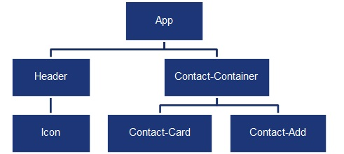
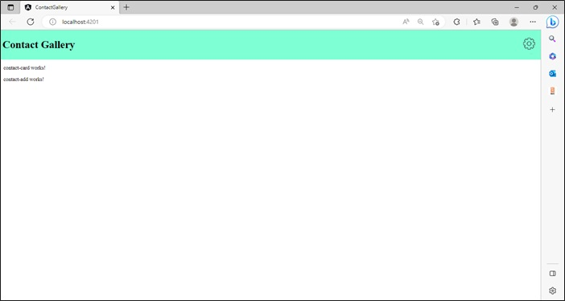
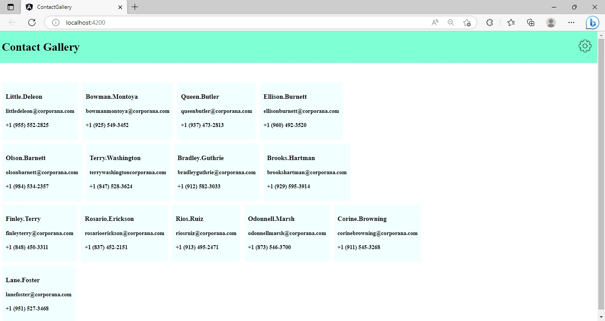
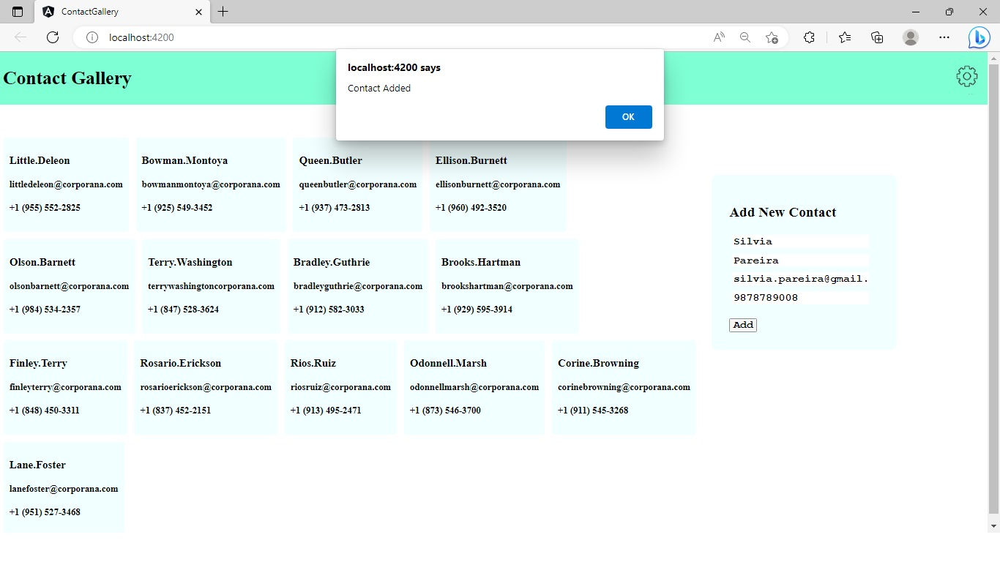
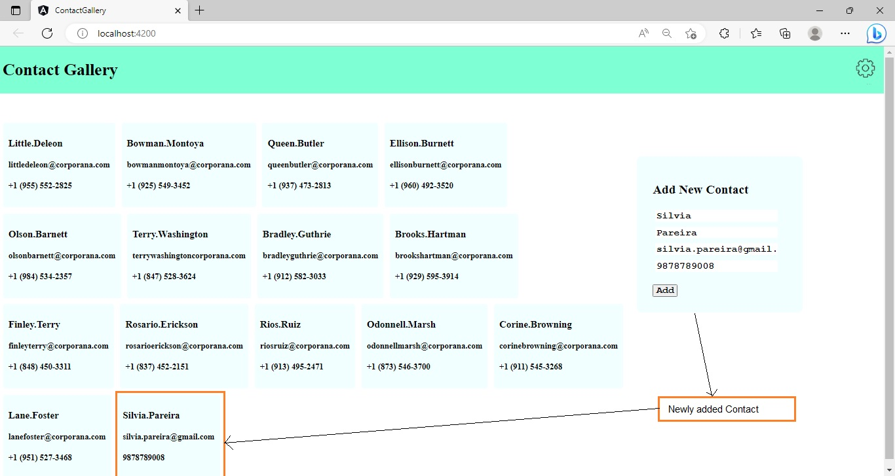

## Practice - Create an Angular Application with Multiple Components to Add and View data​

This sprint has 1 practice.

### Points to Remember

- The boilerplate code contains the basic Angular application code with the `AppComponent` and the `AppModule`.
    - The required components should be created in the same code.
- Components should be rendered based on the component hierarchy designed. 
- The usage of the type `any` to declare variables/constants should be avoided. 
- Unused code should be removed from the solution.
- The names of components, properties, methods given in the task instructions are used in testing, so you must use the same names while coding.

### Instructions for Practice

- Fork the boilerplate into your own workspace. ​
- Clone the boilerplate into your local system. ​
- Open command terminal and set the path to the folder containing the cloned boilerplate code.
- Run the command `npm install` to install the dependencies.
- Open the folder containing the boilerplate code in `VS Code`.​
- Complete the solution in the given partial code provided in the boilerplate.

Notes:​
1. The solution of this practice will undergo an automated evaluation on the CodeReview platform. (Local testing is recommended prior to the testing on the CodeReview platform)​
2. The test cases are available in the boilerplate.​

### Context

An application called `Contact-Gallery` needs to be developed as a single page application. This application should allow the users to manage their contact details. It should allow its users to add a new contact as well as view the existing contacts.​

### Problem Statement

Develop solution for the `Contact-Gallery` application that allows users to add and view contacts using multiple components.

​Note: The tasks to develop the solution are given below:

#### Task 1: Create Components for the `Contact-Gallery` Application
The boilerplate code contains an Angular application named `Contact-Gallery` created using the Angular CLI command, `ng new contact-gallery`. ​

Modify the application code as per the steps given below:​

- Step 1: Create components as shown in the component hierarchy diagram below:

    

    - To create the components, use Angular CLI command: 
	    `ng generate component <component-name>` or  `ng g c <component-name>`

	    Notes:
        1. The names of the components should match with the names displayed in the hierarchy diagram. (this is the requirement of the test code, failing to do so shall lead to test failure)
        2. Delete the existing code from the `app.component.html` file.
- Step 2: Render the components using component selector as per the hierarchy. Refer to the examples below for rendering the components:
    1. `AppComponent` should render the `HeaderComponent` and the `ContactContainerComponent`.​
    2. `HeaderComponent` should render the `IconComponent`.
    3. `ContactContainerComponent` should render the `ContactCardComponent` and the `ContactAddComponent`.​
- Step 3: Design the HeaderComponent and the IconComponent to display the application title and a settings icon.
    - The image for Settings icon is provided in the assets folder.
    - The code snippets to design these components are given below:
        - ***IconComponent***
        ```html
            
        ```
        - ***HeaderComponent***
        ```html
            <div id="header">
                <h1>Contact Gallery</h1>
                <app-icon></app-icon>
            </div>
        ```
##### Expected Output


#### Task 2: Display the Existing Contacts

Modify the `Contact-Gallery` application code to design a view that displays the contacts stored in the `contacts.ts` file.

The steps to implement the display functionality are given below:
- Step 1: Create folder with the name `models` under the `app` folder of the `Contact-Gallery` code.
- Step 2: Copy the `contacts.ts` and `contact.ts` files from the `resources` folder provided with the boilerplate code.
    - The `CONTACTS` array, defined in the `contacts.ts` file under the `models` folder, stores object of type `Contact`. The type `Contact` is defined in the `contact.ts` file under the `models` folder.
- Step 3: In the `ContactCardComponent`, declare a property named `contact` of type `Contact` and adorn it with `@Input()` decorator to mark it as the input property.
    - Make sure that the type `Contact` is imported from the file `contact.ts` located inside the `models` folder.
    - Also, make sure that the decorator `Input` is imported from the `@angular/core` package.
    - The input property `contact` will receive the contact data passed by the parent component -  `ContactContainerComponent`.
    ```typescript
        ...
        import { Contact } from '../models/contact';
        @Component({
            ...
        })
        export class ContactCardComponent implements OnInit {
            @Input() contact?: Contact;
            constructor() { }
            ngOnInit(): void { }
        }
    ```
- Step 4: In the template of the `ContactCardComponent`, render the contact details available with the `contact` property.
    ```html
        <div class="card">
            <h3>{{contact?.firstName}}.{{contact?.lastName}}</h3>
            <h4>{{contact?.email}}</h4>
            <h4>{{contact?.contactNo}}</h4>
        </div>
    ```
- Step 5: Declare property `contacts` in the `.ts` file of the `ContactContainerComponent`.
    - The `contacts` property should be of the type `Contact` array.
    - Make sure that the type `Contact` is imported from the file `contact.ts` located inside the `models` folder.
- Step 6: Assign the data of `CONTACTS` array declared in the `contacts.ts` file to the `contacts` property of the `ContactContainerComponent`.
    - Make sure that the `CONTACTS` array is imported from the file `contacts.ts` located inside the `models` folder.
    ```typescript
        ...
        import { Contact } from '../models/contact';
        import { CONTACTS } from '../models/contacts';
        @Component({
          ...
        })
        export class ContactContainerComponent {  
            contacts: Contact[] = CONTACTS;  
            constructor() { }
        }
    ```
- Step 7: On the template of the `ContactContainerComponent` (`.html` file), iterate through the `contacts` property using the `*ngFor` directive.
    - At each iteration, the `ContactContainerComponent` should render the `ContactCardComponent` providing a contact object as the input to the `contact` property of the `ContactCardComponent` using property binding.
    ```html
        <div id="contact-container">
            <div id="contact-cards">
                <app-contact-card class="contact-card"
                    *ngFor="let contact of contacts" [contact]="contact">
                </app-contact-card>
            </div>
        </div>
    ```
##### Expected Output


#### Task 3: Add a New Contact
Enhance the `Contact-Gallery` application to add the details of a new contact using the `ContactAddComponent`. 

The steps to implement the add functionality are given below:
- Step 1: Declare the output property `contactAdded` in the class of the `ContactAddComponent`.
- Step 2: Define the method `addContact()` in the class of `the ContactAddComponent`.
- Step 3: In the body of the `addContact()` method, the `contactAdded` event should be emitted with the contact data.
```typescript
    import { Component, OnInit, Input, Output, EventEmitter } from '@angular/core';
    import { Contact } from '../models/contact';
    @Component({
       ...
    })
    export class ContactAddComponent implements OnInit {
      contact: Contact = {};
      @Output()
      contactAdded: EventEmitter<any> = new EventEmitter<any>();
      
      constructor() { }  
      ngOnInit(): void { }
      addContact() {
        this.contactAdded.emit(this.contact);
      }
    }
```
- Step 4: Add the following in the template of the `ContactAddComponent`:
    - Input fields to accept the contact's first name, last name, email and contact number details.
    - A button that should call the `addContact()` method when it is clicked.
    ```html
        <div id="contact-input">
            <h2>Add New Contact</h2>
            <input type="text" placeholder="First Name" required [(ngModel)]="contact.firstName"><br/>
            <input type="text" placeholder="Last Name" required [(ngModel)]="contact.lastName"><br/>
            <input type="email" placeholder="Email" required [(ngModel)]="contact.email"><br/>
            <input type="text" placeholder="Contact Number" required [(ngModel)]="contact.contactNo"><br/>
            <br/>
            <button (click)="addContact()">Add</button>
        </div>
    ```
- Step 5: In the class of the `ContactContainerComponent`, define the method onContactAdded() which will be called to handle the `contactAdded` event.
    - The handler method should accept contact data passed by the child component using `$event` argument.
    - The handler method should update the `contacts` property with newly added contact details and raise an alert with the message "Contact Added".
    ```typescript
        // import statements@Component({ ... })
        export class ContactContainerComponent implements OnInit {
            contacts: Contact[] = CONTACTS;
            constructor() { }
            ngOnInit(): void { }
            
            onContactAdded($event:any) {
                this.contacts.push($event);
                alert(`Contact Added`);
            }
        }
    ```
- Step 6: In the template of the `ContactContainerComponent`, while rendering the `ContactAddComponent`, call the `onContactAdded()` method to listen to and handle `the contactAdded` event.

##### Expected Output with Alert Box


##### Expected Output with Added Contact


### Test the Solution Locally​
Test the solution first locally and then on the `CodeReview` platform. Steps to test the code locally are:
- From the command line terminal, set the path to the folder containing cloned boilerplate code.
- Run the command `ng test` or `npm run test` to test the solution locally and ensure all the test cases pass.
- Refactor the solution code if the test cases are failing and do a re-run.​
- Finally, push the solution to git for automated testing on the CodeReview platform.

### Test the Solution on the `CodeReview` Platform
Steps to test the code on the `CodeReview` platform are:
- Open the submission page at [https://codereview.stackroute.niit.com/#/submission](https://codereview.stackroute.niit.com/#/submission).
- Submit the solution.
- For the failed test cases, refactor the code locally and submit it for re-evaluation.

