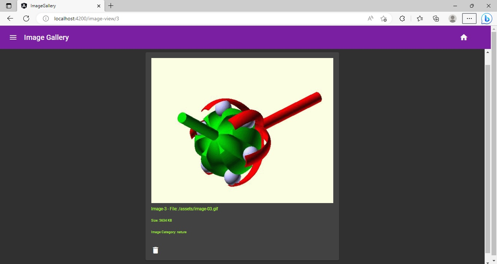
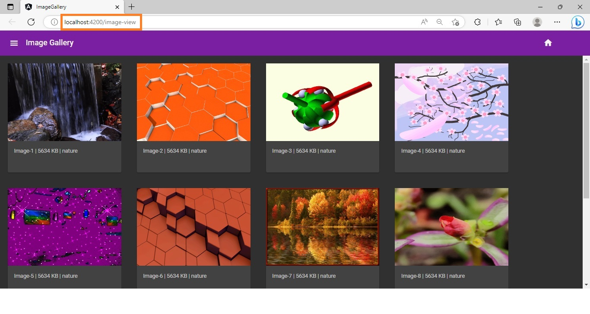
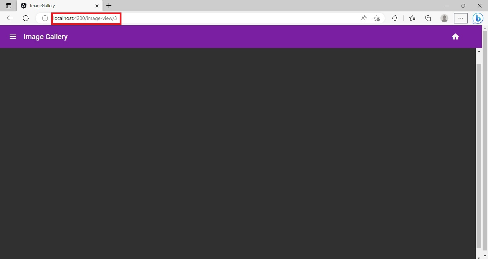
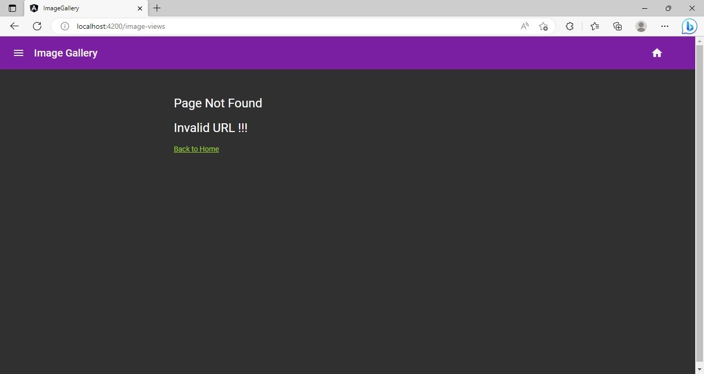
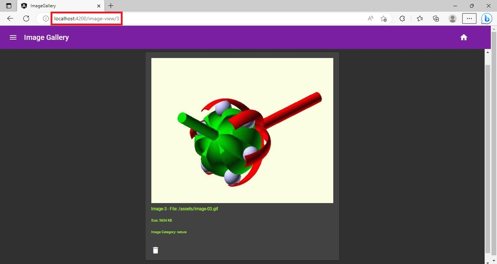

## Practice :: Create a Navigable Angular Application ​

This sprint has 1 practice.

### Points to Remember

- Routing should be enabled at the time of creation of application.
- The route definition must have set up for default route and wildcard route.
- The wildcard route should be the last route.
- The default route should be just before the wildcard route.


### Instructions for Practice

- Fork the boilerplate into your own workspace. ​​​
- Clone the boilerplate into your local system. ​​​
- Open command terminal and set the path to the folder containing the cloned boilerplate code.​​​
- Run the command `npm install` to install the dependencies.​
- Open the folder containing the boilerplate code in `VS Code`.​​

Note: This practice would be manually evaluated and hence the boilerplate does not contain the test code.

### Context

Graffiti Designers is a software design and development company that provides quality service in the field of web development. 

CreativeIdeas company has given a project to Graffiti Designers to develop an `Image-Gallery` application as a single-page application with multiple views.

The primary objective of the `Image-Gallery` application is to provide high-quality image content to its users.

In the initial stages of development, the landing view of the application should display the images with basic details such as caption and size. Each image should be clickable. Whenever an image is clicked, the application should display the enlarged view of the clicked image in another view.

Since the application has multiple views, the user should be able to navigate smoothly from one view to another.

Note: The landing view and the image view are being shown below:

##### Expected Output - Landing View


##### Expected Output - Image View


#### About the Code and the Image Files
- The boilerplate code contains the folder `source-code` which contains the component and service code files.
    - The code files will have to be copied to the `app` folder after a new application is created.
- The boilerplate code also contains the folder `images` which contains image files required by this application.
    - The image files from the `images` folder will have to be copied to the `assets` folder located inside the `src` folder of the newly created application.

### Problem Statement

Create a navigable Angular application named `Image-Gallery`. Enable routing in the application while it is being created. 

Define route configurations and add routes to the application to allow the users to navigate between different views of the application. 

Note: The tasks to define the routes in the application are given below:

#### Task 1: Create a Route Enabled `Image-Gallery` Application

- Step 1: Create an application called `Image-Gallery` using the Angular CLI command inside the folder containing the boilerplate (Refer to the command given below)

	`ng new image-gallery`

    - Respond with "Y" when the prompt appears on the screen that asks whether the route should be enabled in the application.
        - You will observe the following when the route enabled application is created:
            1. An additional `app-routing.module.ts` file is added, which contains:
                - Definition of AppRoutingModule
                - Required imports from `@angular/router` package 
                - Declaration of `routes` array
            2. The `AppRoutingModule` will be imported in the `AppModule`.
- Step 2: Copy the image files available in the `images` folder of the boilerplate to the `assets` folder of the `src` folder of the `Image-Gallery` application.

- Step 3: Install Angular Material in order to use Angular Material components, themes, and schematics. (Refer to the command given below)

	`ng add @angular/material@14`
- Step 4: Delete the files `app.component.css`, `app.component.html` and `app.component.ts` from the `app` folder of the `Image-Gallery` application.
- Step 5: Copy the files available in the `source-code` folder of the boilerplate to the `app` folder of the `Image-Gallery` application.
- Step 6: Import the following modules and components in the `app.module.ts` file:
    `LayoutModule`, `MatSidenavModule`, `MatListModule`, `MatIconModule`, `MatToolbarModule`, `MatCardModule`, `MatButtonModule`, `ImageViewComponent`, `BrowserAnimationsModule`, `HomeComponent`, `NavbarComponent`, and `PageNotFoundComponent`

- Step 7: Add the following components in the `declarations` property of `the AppModule`:
    - `NavbarComponent`, `HomeComponent`, `ImageViewComponent`, `PageNotFoundComponent`
- Step 8: Add the following modules in the `imports` property of `the AppModule`:
    - `LayoutModule`, `MatListModule`, `MatSidenavModule`, `MatIconModule`, `MatToolbarModule`, `MatCardModule`, `MatButtonModule`

Note: After completion of Task 1, the images would not be loaded in the `Image-Gallery` application, since the `HomeComponent` (which renders the images) is not loaded.

#### Task 2: Define Routes in `AppRoutingModule`
Following routes should be defined for enabling navigation in the Image-Gallery application:
    - `/image-view` (navigates to `HomeComponent`).
    - `/image-view/:id` (navigates to `ImageViewComponent`).
    
    - `/` (redirects to `/image-view` URL).
    - Wild card route (handles the page not found error).

- Step 1: To do the above, in the `app-routing.module.ts` file, populate the `routes` array with the route definitions. (Refer to the code given below)

    ```ts
        const routes: Routes = [
          { path: "image-view", component: HomeComponent },
          { path: "image-view/:id", component: ImageViewComponent },
          { path: "", redirectTo: "/image-view", pathMatch: "full" },
          { path: "**", component: PageNotFoundComponent }
        ];
    ```
#### Task 3: Add Routes to the `Image Gallery` Application

- Step 1: In the `navbar.component.html` file, add the `<router-outlet>` directive inside the `<mat-sidenav-content>` element. (Refer to the code given below)
    ```html
        <mat-sidenav-content>
            <router-outlet></router-outlet>
        </mat-sidenav-content>
    ```

The `<router-outlet>` directive specifies the physical location for loading the routed components.

- Step 2: Add `routerLink` attributes to the anchor tags inside the `mat-toolbar` in the `navbar.component.html` file.
    - The values of the `routerLink` attribute should be the route path that allows navigation to the `HomeComponent`.
    - The path can be either a default path that redirects to `image-view` or the specific path `/image-view`, both navigating to the `HomeComponent`. (Refer to the code given below)

        ```html
            <a routerLink="/">Image Gallery</a>
            <a routerLink="/image-view" id="home" mat-stroked-button>
                <mat-icon>home</mat-icon>
            </a>
        ```
    - Test the functioning of the anchor tags by:
        - Clicking on the `home` icon on toolbar. 
            - Users will continue to remain on the landing view. 
        - Typing `http://localhost:4200/` in the address bar of the browser. 
            - Users will continue to remain on the landing view and the URL of the browser will change to `http://localhost:4200/image-view`.

Note: The expected output after the tests for the default route (`http://localhost:4200/`)and the route with path `/image-view` (`http://localhost:4200/image-view`) is shown below:

##### Expected Output



- Step 4: Add the `routerLink` attribute to the anchor tag of the `mat-card` element in the `home.component.html` file.
    - The value of the `routerLink` attribute should be the route path that accepts `id` as the route parameter, allowing navigation to the `ImageViewComponent`. (Refer to the code given below)​
        ```html
            <mat-card *ngFor="let image of imageList">
                 <a routerLink="{{image.id}}">...</a>
            </mat-card>
        ```
    - Test the workings of this anchor tag by clicking on any image.

        - At this point in time, the `ImageViewComponent` gets displayed but will not display the selected image and its details, since the code to read the route parameter will be done in the subsequent task.
        - If the image with `id` `3` is clicked, the address bar of the browser should display the path value as `http://localhost:4200/image-view/3`.

Note: The expected output after the test mentioned above is shown below:

##### Expected Output



- Step 5: Add `the routerLink` attribute to the anchor tag in the `page-not-found.component.html` file.
    - The value of the `routerLink` attribute should be the route path that allows navigation to the `HomeComponent`. (Refer to the code given below)​
        ```html
            <a routerLink="/">Back to Home</a>
        ```
    - Test the wild card route by typing an invalid path in the address bar of the browser, for example, `http://localhost:4200/image-views`
        - For any invalid URL, the application should now redirect the users to the `PageNotFoundComponent`.
        - Clicking on hypertext `Back to Home` should redirect the users to the landing view.


Note: The expected output after the test mentioned above is given below:

##### Expected Output



#### Task 4: Retrieve Route Information to Display the Selected Image
- Step 1: Step 1: In the `image-view.component.ts` file, inject `ActivatedRoute` to the `ImageViewComponent`. (Refer to the code given below)​
    ```ts
        constructor(private activatedRoute: ActivatedRoute, 
            private imageService: ImageService) { 
        }
    ```
- Step 2: Implement the `OnInit` interface and implement its `ngOnInit()` method to read the value of the route parameter `id`. (Refer to the code given below)​

    ```ts
        ngOnInit(): void {
            this.activatedRoute.paramMap.subscribe(data => {
                let id = data.get('id') ?? 0;
                this.imageService.getImage(+id).subscribe(data => {
                    this.image = data;
                });
            });
        }
    ```
    **Note:** `ImageService` is already injected in the boilerplate code. This service has three methods that can either fetch all the images, or fetch a specific image for a given `imageId`, or can delete an image for a given `imageId`.
- Test the task to retrieve the route information by clicking on any image
    - The application should navigate to the `ImageViewComponent`.
    - The `ImageViewComponent` should display the selected image in enlarged size with the image details and a delete button below it.

##### Expected Output




#### Enable Programmatic Navigation from the `ImageViewComponent` to the `HomeComponent`

- Step 1: Create a service with the name ImageRouter: (Refer to the command given below)

    `ng g s services/image-router`
- Step 2:  Step 2: Inject the `Router` service imported from the `@angular/router` package. (Refer to the code given below)
    ```typescript 
        constructor(private router: Router) { 
        }
    ```
- Step 3: Add the method `navigateToHome()` to `ImageRouter` service. The method should call the `navigate()` method of the `Router` service and provide the default path ("") or path "`image-view`" to navigate to the `HomeComponent`.
    ```ts
        navigateToHome() {
            this.router.navigate([""]);
        }
    ```
- Step 4: Inject the `ImageRouter` service in the `ImageViewComponent` along with the already injected services.
    ```typescript 
            constructor(private activatedRoute: ActivatedRoute, 
            private imageService: ImageService,
            private imageRouter: ImageRouterService) { 
        }
    ```
- Step 5: The `image-view.component.ts` file contains method `delete()`, that calls the `deleteImage()` method of the `ImageService` to delete the displayed image. Inside the `delete()` method, once the image is deleted, call the method `navigateToHome()` of `ImageRouter` service to programmatically navigate to the `Home` component.
    ```ts
        this.imageService.deleteImage(this.image.id).subscribe(data => {
            this.imageRouter.navigateToHome(); //code to navigate to home      
        });
    ```
    - Test the task to enable programmatic navigation by clicking on an image in `Home` view.
        - The app should navigate to the `image-view` displaying the selected image in enlarged size.
        - Click on the delete button displayed below the image details.
            - The image gets deleted from the array and the user is navigated to the `Home` view.

## Submission Instructions

- Push the code to git and share the link with the mentor for manual evaluation.
